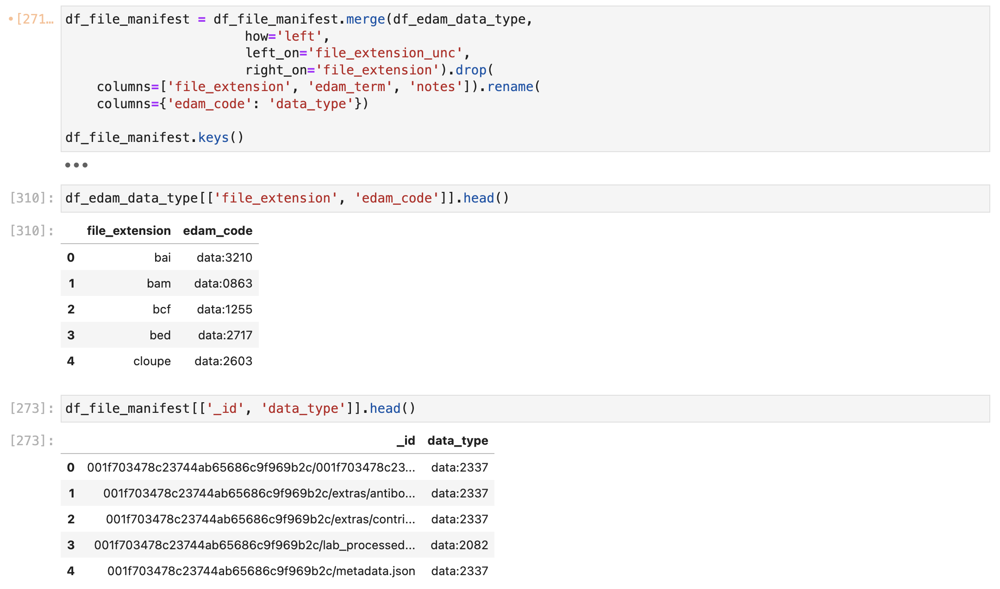

As part of my work as a Data Curator for NIH-funded consortial data repositories [HuBMAP](https://hubmapconsortium.org/) and [SenNet](https://sennetconsortium.org/), I am charged with "translating" the information (metadata) about our datasets to other knowledgebases operated by NIH.

What does this mean, and for what purpose?

It means that our repositories describe the world in one way, while the target repositories describe it in a different way. In order for our datasets to be compatible with the target repository, and maintain the rich, scientifically useful information we have curated, I must understand both ways of describing the data, and apply the appropriate labels for the target repository. This ensures that the target repository's records are accurate: consistent with our own records and a faithful representation of reality.

An example to explain this concept can be seen in the various vocabulary terms each repository uses to describe library strategy.

| Repository | Local term | Sample of allowed values |
|------------------------|------------------------|------------------------|
| HuBMAP / SenNet | dataset_type | ATACseq, ATACseq-bulk, bulk-RNA, RNAseq, sciATACseq, snATACseq, WGS, MUSIC |
| [Common Fund Data Ecosystem (CFDE)](https://commonfund.nih.gov/dataecosystem) Cross-cut Metadata | assay_type | bulk assay for transposase-accessible chromatin using sequencing, transcription profiling by RNA sequencing assay, single cell combinatorial indexing assay for transposase-accessessable chromatin using sequencing, single-nucleus ATAC-seq, whole genome sequencing assay, sequencing assay |
| [Database of Genotypes and Phenotypes (dbGaP)](https://dbgap.ncbi.nlm.nih.gov/home/) | library_strategy | ATAC-seq, RNA-seq, WGS, OTHER |
| [Gene Expression Omnibus (GEO)](https://www.ncbi.nlm.nih.gov/geo/index.cgi) | library_strategy | ATAC-seq, scATAC-seq, RNA-Seq, scRNA-Seq, miRNA-Seq, ncRNA-Seq |

: Library strategy terms for five biomedical data repostories.

Comparing some of the terms across repositories, we see spelling differences (e.g., `RNAseq` vs. `RNA-seq` vs. `RNA-Seq`) but also different levels of granularity—for example, single-nucleus ATACseq (snATACseq) vs. dbGaP's generic "ATAC-seq" (which may correspond to bulk, single-cell, or single-nucleus ATACseq). We see that some terms like MUSIC (Multi-subject Single-cell deconvolution) can only be represented as OTHER in dbGaP. And the CFDE terms actually come from the [Ontology for Biomedical Investigations (OBI)](https://obi-ontology.org/), which means this ontology must be understood and the appropriate identifiers used (e.g., the code for "transcription profiling by RNA sequencing assay" is [`OBI:0001271`](http://purl.obolibrary.org/obo/OBI_0001271)).

Assay type (AKA library strategy) is not the only controlled term for these target repositories. Other examples of properties with controlled vocabularies include file format (from [EDAM](https://edamontology.org/)), subject ethnicity, anatomy (from [UBERON](https://obophenotype.github.io/uberon/)), library source (genomic, transcriptomic, etc.), library layout (single- or paired-end), and instrument manufacturer and model (e.g., Illumina NextSeq 5000).

For each controlled field in the target repository, I must develop a term mapping or "crosswalk." This looks like table with two columns, with the term from repo A and the corresponding, equivalent term in repo B. Sometimes these require consultation with experts. Other times, an automatic mapping may be impossible because the target vocabulary may be more granular, requiring some manual intervention to determine the appropriate term choice.

```{mermaid}
%%| fig-align: "center"
flowchart
    n1["Local knowledgebase (A) records"] -- HTTP API --> n3["Fetched table"]
    n3 --> n5["Translated table"]
    n5 -- submission process --> n4["Target knowledgebase (B) records"]
    n2["Term mapping (A:B)"] -- left join --> n5

    n1@{ shape: rounded}
    n3@{ shape: rounded}
    n5@{ shape: rounded}
    n4@{ shape: rounded}
    n2@{ shape: rounded}
```

To apply the term mapping in the context of a Jupyter notebook with Pandas, we load the mapping table as a DataFrame, and then apply a left join on the table of datasets. (Doing this task relationally, rather than with `Series.map()` with a dict or similar, should be more performant and scalable, as well as easier to maintain, since mappings are stored as CSV files.) The result is that the dataset table now has the mapped column added, with the appropriate (mapped) value for each row. The local version of the column may then be dropped from the table. This process is repeated for all columns needing mapping. After all needed manipulations, the record set may be submitted to the target repository and should pass their validation.

{fig-align="center"}

What is the utility of these translations? The immediate answer is that they allow interoperability between repositories with minimal loss of information. (Our goal is always to avoid information being "lost in translation," while taking account of how a schema forces us to describe records.) But the bigger answer depends on the reason(s) we are submitting to the target repository, for example:

- increasing discoverability of our data

- complying with funders' reporting requirements

- making sensitive, HIPAA-protected human genetic sequencing data available via the appropriate NIH-operated secure enclave (dbGaP)

For any of these applications to succeed, translation across heterogeneous information schemata is necessary.
